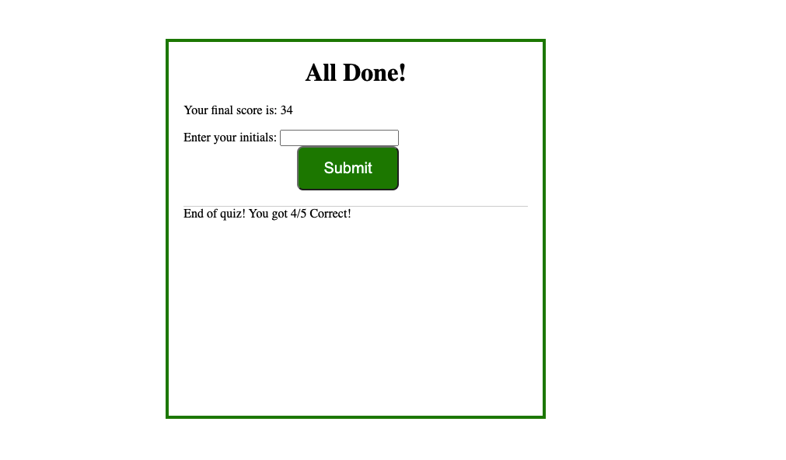

# Coding Quiz 4

The Coding Quiz we were assigned to build had to meet the following criteria:

```
GIVEN I am taking a code quiz
WHEN I click the start button
THEN a timer starts and I am presented with a question
WHEN I answer a question
THEN I am presented with another question
WHEN I answer a question incorrectly
THEN time is subtracted from the clock
WHEN all questions are answered or the timer reaches 0
THEN the game is over
WHEN the game is over
THEN I can save my initials and score
```

# Technologies Used: 
* HTML
* CSS
* Javascript


# Project Explanation: 
Application run a quiz that ask questions about JavaScript. Application switches text dynamically as questions are answered. After completing quiz, the score is computed and stored on local storage.

# Screenshots





In order to meet criteria, I had to complete various tasks within Javascript. I think things turned out fairly okay. This will serve as a useful exercise to sharpen my javascript coding skills. I'll for sure need it, lol. 

# Live Link of Deployed App
Deployed version: https://staylight16.github.io/Coding-Quiz-4/index.html 
